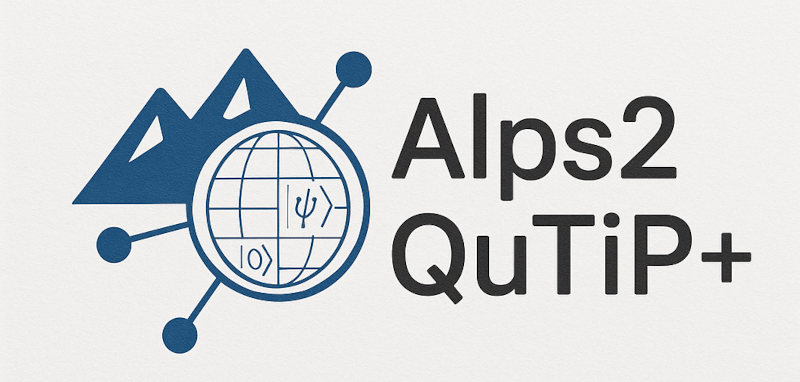

ALPS2QuTip+ Documentation
=========================

A Python toolbox to generate quantum models from ALPS XML files, build operator representations, and simulate quantum dynamics.

.. toctree::
   :maxdepth: 1
   :caption: Get Started
	    
   what-is-alps2qutippp
   installing
   running
   bugs
   quickstart
   guide/guide   
   apidoc/index

Indices and tables
==================

* :ref:`genindex`
* :ref:`modindex`
* :ref:`search`
